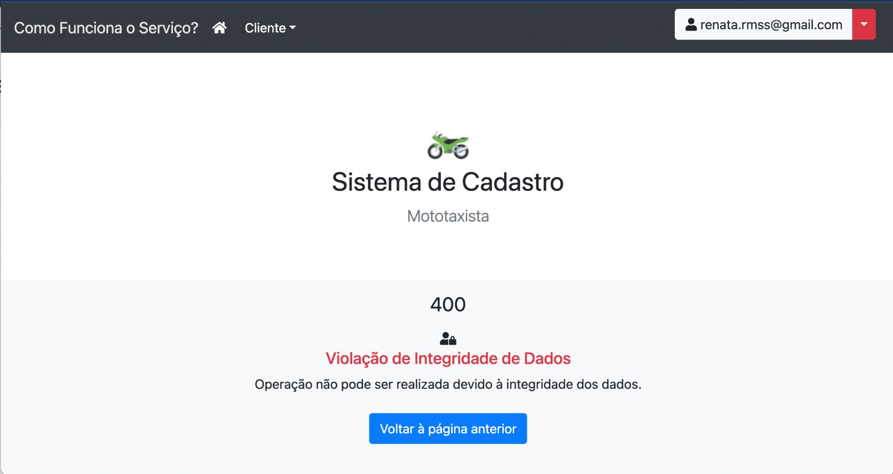

<h2 align="center">CAD-MOTOTAXISTA - Documentação Técnica</h2>

**Figura 1 – Mensagem de Violação de Integridade 400.**
Esta imagem ilustra a resposta do servidor quando uma solicitação viola as regras de integridade definidas, resultando em um erro 400.

**Figura 2 – Mensagem de Área Restrita ao tentar acessar recurso protegido 403.**
Esta imagem mostra a resposta do servidor quando um usuário tenta acessar um recurso protegido sem as permissões adequadas, resultando em um erro 403.

**Figura 3 - Usuario inativo ou não encontrado erro 404.**
Esta imagem representa a resposta do servidor quando um usuário tenta acessar um recurso associado a um usuário inativo ou inexistente, resultando em um erro 404.

